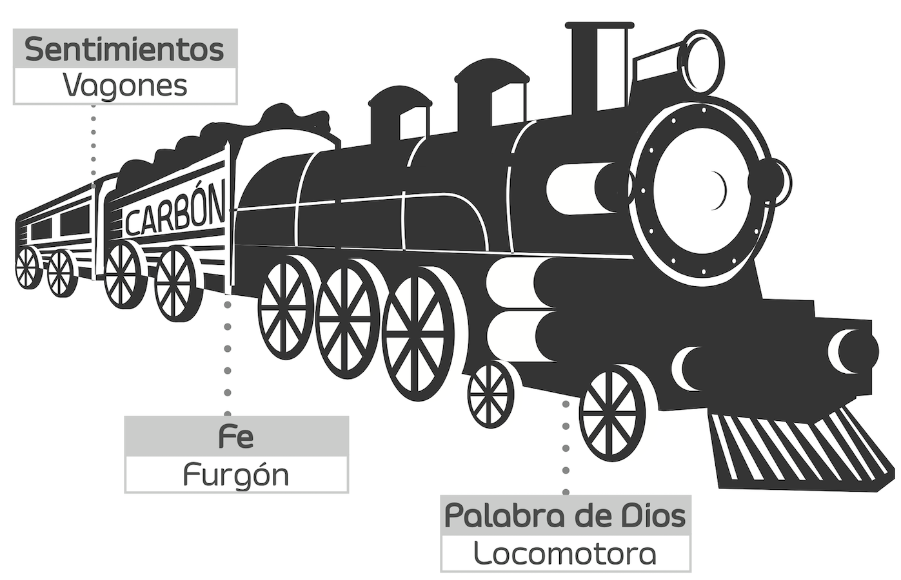

## Apocalipsis 3:20
"He aquí, yo estoy a la puerta y llamo; si alguno oye mi voz y abre la puerta, entraré a él, y cenaré con él, y él conmigo."

## Yo al mando

[//]: # (E = Ego, el yo en el trono de su vida.)
[//]: # (o = Intereses personales bajo el control suyo, en desorden y confusión.)
[//]: # († = Cristo, fuera de su vida.)

## Jesús al mando

[//]: # († = Jesucristo en el trono de su vida.)
[//]: # (E = Su ego destronado.)
[//]: # (o = Intereses personales y diversas actividades bajo el control de Cristo, lo que trae como resultado armonía y propósito)

## ¿Quién está al mando en su vida?

## 1ª Juan 5:9-12

_Si recibimos el testimonio de los hombres, mayor es el testimonio de Dios; porque este es el testimonio con que Dios ha testificado acerca de su Hijo. El que cree en el Hijo de Dios, tiene el testimonio en sí mismo; el que no cree a Dios, le ha hecho mentiroso, porque no ha creído en el testimonio que Dios ha dado acerca de su Hijo. Y este es el testimonio: que Dios nos ha dado vida eterna; y esta vida está en su Hijo. El que tiene al Hijo, tiene la vida; el que no tiene al Hijo de Dios no tiene la vida._

## ¿Cuál testimonio es más digno de confianza, el de Dios o el del hombre? ¿Por qué?

## ¿En qué consiste el testimonio de Dios?

##  _Y este es el testimonio: que Dios nos ha dado vida eterna; y esta vida está en su Hijo._

## ¿Dónde está Cristo ahora con relación a usted? ¿Por qué?

## ¿En qué fundamenta su seguridad de que Cristo entró en su vida?

## **En la fidelidad de Dios y en su Palabra**

## Seguridad más alla de los sentimientos

Los seres humanos acostumbramos a expresar nuestra seguridad en lo que sentimos.
En caso de que no hubiera sentido nada, ¿Dios entró o no entró en mi vida?

##
_A partir de hoy es más importante creer en lo que Dios dice en su Palabra, es decir en su testimonio, que en lo que yo siento, oigo o digo, es decir en mi testimonio. Cristo está dentro de mí, porque Él dijo que entraría si yo lo invitaba._

## El tren

## 
Con Dios y su Palabra como conductores de mi vida ¿cuál resultado puedo obtener?

## Apocalipsis 3:20
_"He aquí, yo estoy a la puerta y llamo; si alguno oye mi voz y abre la puerta, entraré a él, y cenaré con él, y él conmigo."_

##
Debido a que Jesús prometió entrar en mi corazón, confío en que siempre estará conmigo a pesar de lo que yo haga, sean cosas buenas o malas.

## Mateo 28:20
_"Enseñándoles que guarden todas las cosas que os he mandado; y he aquí yo estoy con vosotros todos los días, hasta el fin del mundo. Amén."_

## 
El Señor Jesucristo estará conmigo todos los días hasta el fin del mundo.

## Lucas 1:37
_"Porque nada hay imposible para Dios."_

##
Nada hay imposible para Dios.

## Juan 14:21
_"El que tiene mis mandamientos, y los guarda, ese es el que me ama; y el que me ama, será amado por mi Padre, y yo le amaré, y me manifestaré a él."_

## 
Debo obedecerle y Él se manifestará en mí.

## 1ª Corintios 10:13
_"No os ha sobrevenido ninguna tentación que no sea humana; pero fiel es Dios, que no os dejará ser tentados más de lo que podéis resistir, sino que dará también juntamente con la tentación la salida, para que podáis soportar."_

##
Dios me dará juntamente con la tentación la salida, para que pueda resistir.

## 2ª Timoteo 1:7
_"Porque no nos ha dado Dios espíritu de cobardía, sino de poder, de amor y de dominio propio."_

##
No tengo espíritu de cobardía sino de poder, amor y dominio propio.

## Seguridad más alla de los sentimientos
**Su seguridad depende de tomar una decisión: sigue viviendo de acuerdo con lo que siente y lo que piensa, o prefiere confiar en Dios, disponiéndose a conocerlo por medio de su Palabra.**

## Pedro, pescador de hombres (Lucas 5:1-3)

1 Aconteció que estando Jesús junto al lago de Genesaret, el gentío se agolpaba sobre él para oír la palabra de Dios. 
2 Y vio dos barcas que estaban cerca de la orilla del lago; y los pescadores, habiendo descendido de ellas, lavaban sus redes. 
3 Y entrando en una de aquellas barcas, la cual era de Simón, le rogó que la apartase de tierra un poco; y sentándose, enseñaba desde la barca a la multitud. 

## Pedro, pescador de hombres (Lucas 5:4-5)
4 Cuando terminó de hablar, dijo a Simón: Boga mar adentro, y echad vuestras redes para pescar.
5 Respondiendo Simón, le dijo: _Maestro, toda la noche hemos estado trabajando, y nada hemos pescado_; **mas en tu palabra echaré la red**.

## Pedro, pescador de hombres (Lucas 5:6-8)
6 Y habiéndolo hecho, encerraron gran cantidad de peces, y su red se rompía. 
7 Entonces hicieron señas a los compañeros que estaban en la otra barca, para que viniesen a ayudarles; y vinieron, y llenaron ambas barcas, de tal manera que se hundían. 
8 Viendo esto Simón Pedro, cayó de rodillas ante Jesús, diciendo: Apártate de mí, Señor, porque soy hombre pecador. 

## Pedro, pescador de hombres (Lucas 5:9-11)
9 Porque por la pesca que habían hecho, el temor se había apoderado de él, y de todos los que estaban con él, 
10 y asimismo de Jacobo y Juan, hijos de Zebedeo, que eran compañeros de Simón. Pero Jesús dijo a Simón: No temas; desde ahora serás **pescador de hombres**. 
11 Y cuando trajeron a tierra las barcas, dejándolo todo, le siguieron.

